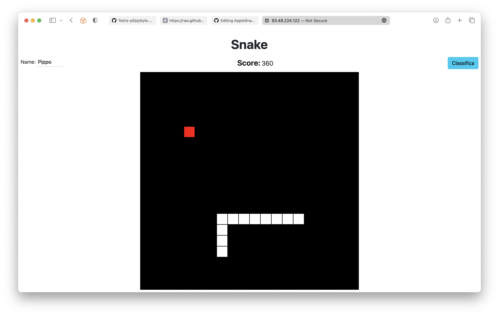
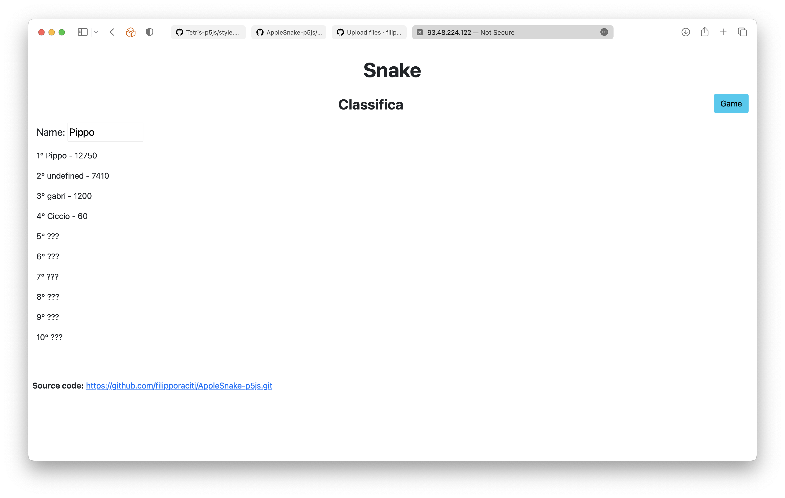
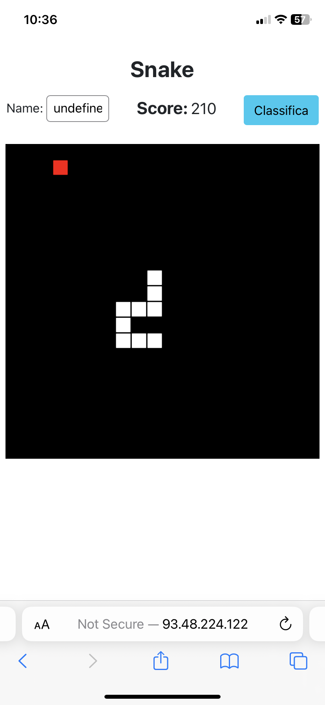
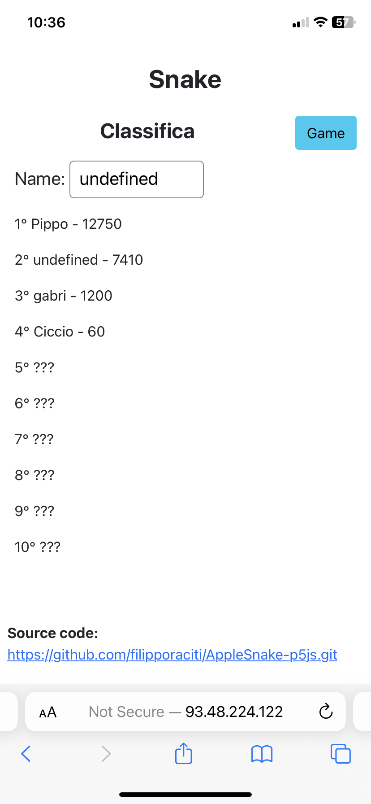

# AppleSnake-p5js

Snake game created with p5's library.

There is also an api to add or view score. <-- file: <a href="server.py">server.py</a>

``` bash

python3 server.py
```
After that open <a href="index.html">index.html</a> file.

If ranking doesn't work, you need to change the ip address from <a href="script.js">script.js</a>'s file, where i make requests with fetch methods.

## Photos
### Desktop



### Mobile



